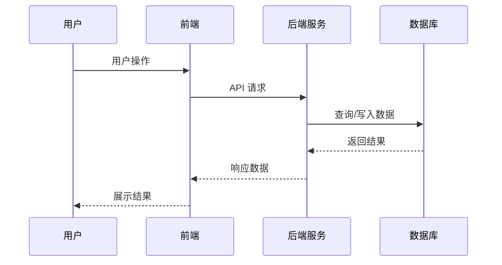

# Code Design Exporter

> 代码架构分析器 - 分析代码模块以理解系统功能设计、实现原理、工作流程和数据库模型

## 简介

`code-design-exporter` 是一个 Claude Code Skill，专门用于深入分析代码模块，帮助开发者理解：

- 系统功能设计
- 实现原理
- 完整工作流程
- 数据库模型

当您需要回答诸如"这个功能如何工作？"、"为什么会出现这个问题？"或"帮助理解架构"等问题时，这个技能会自动触发。

## 使用场景

| 场景 | 示例问题 |
|------|----------|
| 功能理解 | "这个功能如何工作？"、"用户注册流程是怎样的？" |
| 问题诊断 | "为什么会出现这个问题？"、"数据不一致可能是什么原因？" |
| 架构解释 | "帮助理解模块间的依赖关系"、"系统整体架构是什么？" |
| 调试指导 | "我遇到了这个错误 - 可能是什么原因？" |

## 使用方法

### 1. 确保已安装 Claude Code

如果您还没有安装 Claude Code，请访问 [Claude Code 官网](https://claude.com/claude-code) 了解安装方法。

### 2. 配置 Skill

将此 Skill 配置到您的 Claude Code 环境中。Claude Code 会在您提出相关问题时自动触发该技能。

### 3. 直接提问

在您的项目目录中，直接向 Claude Code 提出相关问题：

```
"帮我分析用户登录功能的实现流程"
"为什么数据同步会失败？"
"理解订单处理的架构设计"
```

## 输出内容

Code Design Exporter 会生成详细的 Markdown 格式分析报告，包含以下章节：

### 1. 功能概述
- 功能的简要描述
- 业务价值和目的
- 核心职责

### 2. 功能设计
- 主要功能和特性
- **工作流程图**（使用 Mermaid 绘制）
- 数据模型说明

### 3. 数据库模型
- 相关数据库表及其字段说明
- 表之间的关系
- 关键索引和约束

### 4. 常见问题与排查指南
- 功能相关故障诊断表
- 日志查看指南
- 问题定位方法

## 输出示例

### 工作流程图示例



### 数据库表结构示例

| 字段名 | 类型 | 说明 |
|---------|------|------|
| id | INT | 主键 |
| name | VARCHAR | 名称 |
| create_time | DATETIME | 创建时间 |

## 特点

- **可视化流程**：所有图表均使用 Mermaid 格式，易于理解和复用
- **完整追踪**：从前端到数据库的完整调用链
- **实用指南**：提供可操作的排查步骤和日志查看方法
- **准确引用**：报告包含相关代码文件和行号的引用

## 注意事项

1. **自动触发**：当您提出相关问题时，Claude Code 会自动使用此技能
2. **深度分析**：此技能专注于架构分析，不适合简单的代码生成任务
3. **依赖代码库**：分析的准确性取决于代码库的可读性和注释质量

## 仓库信息

- **GitHub**: [https://github.com/ZhaoRuidong/code2design](https://github.com/ZhaoRuidong/code2design)
- **License**: MIT

## 贡献

欢迎提交 Issue 和 Pull Request！
