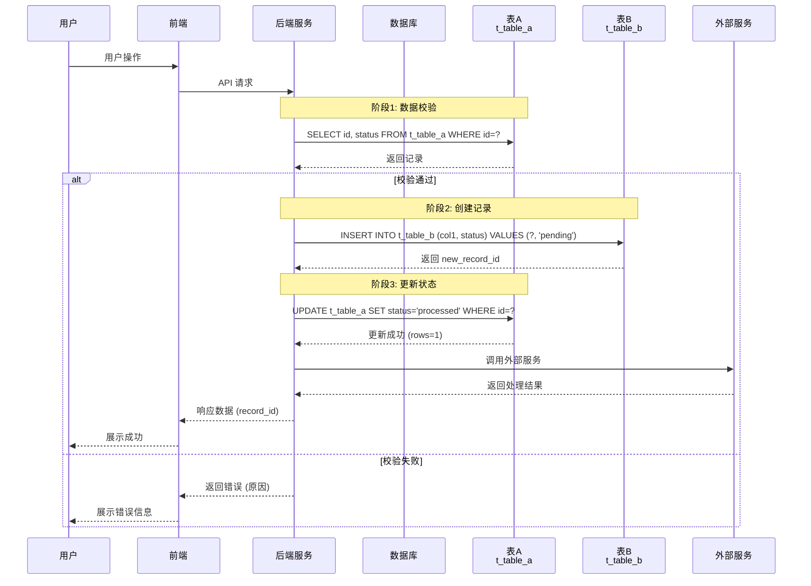
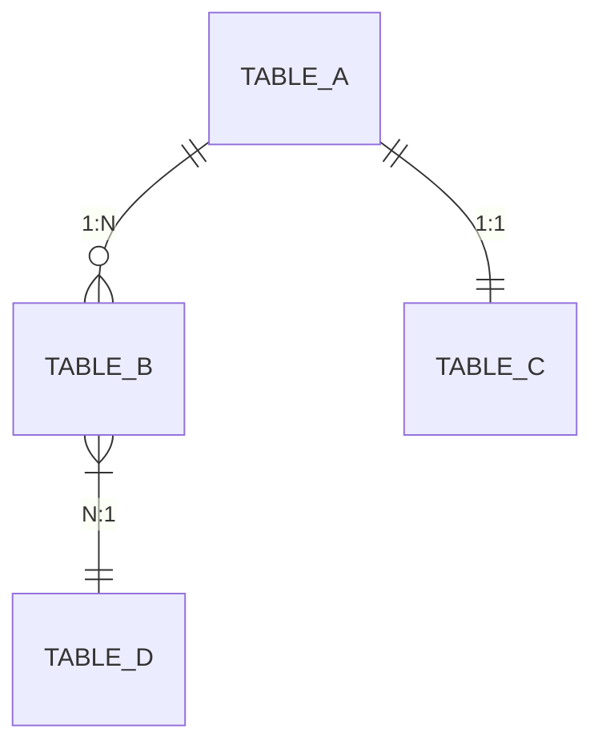
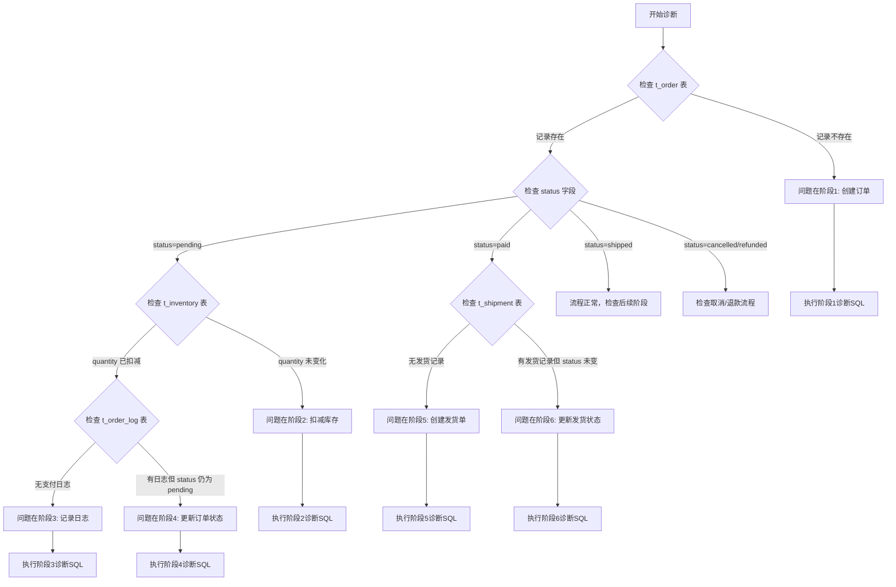
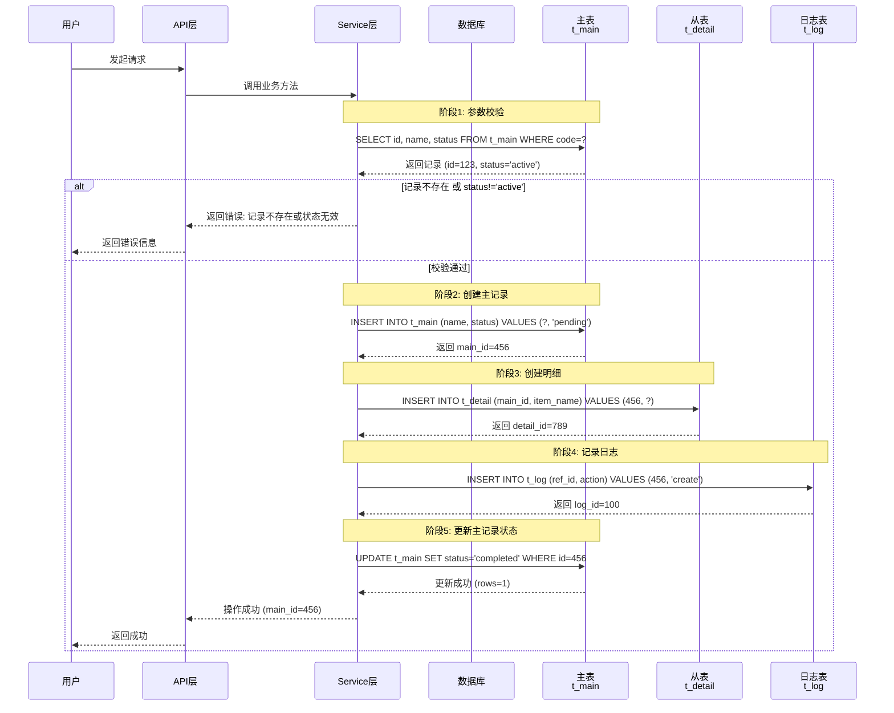
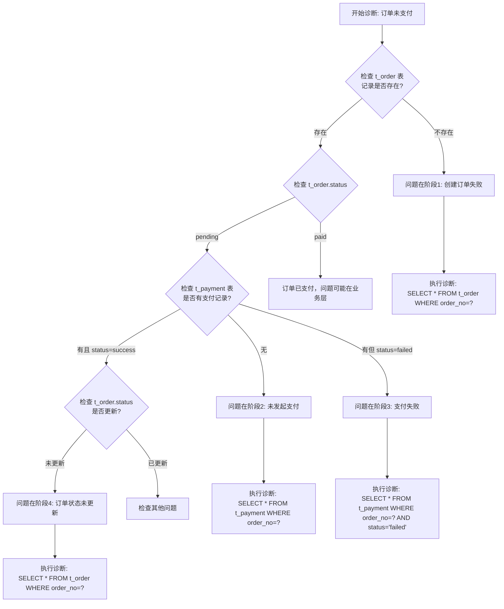
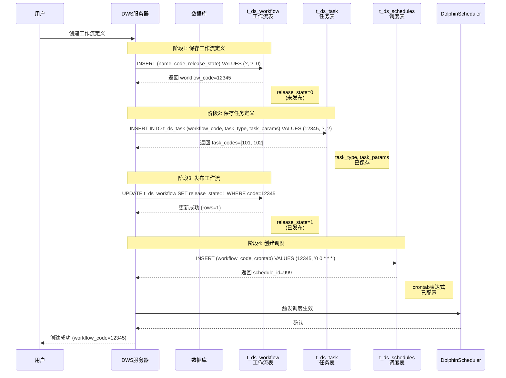

# 代码架构分析器

## 概述

本技能分析代码模块，为开发者提供深入的功能设计理解、实现原理、完整工作流程和数据库模型说明。帮助开发者理解功能如何运作、识别问题根因、系统地进行问题诊断。

## 使用时机

- **用户询问时**："这个功能如何工作？"、"为什么会出现这个问题？"、"帮助理解架构"、"我遇到了这个错误 - 可能是什么原因？"
- **用途**：功能设计理解、问题诊断、架构解释、调试指导
- **不用于**：简单文件读取、基础代码生成或不需要深入架构理解的任务

## 工作流程

### Step 1: 理解请求
- 识别要分析的具体功能或模块
- 确定分析范围（模块、服务或跨服务）
- 明确是否有需要诊断的具体问题

### Step 2: 分析代码库
1. **定位主要入口点**：功能的入口类或控制器,忽略 dolphinscheduler-api 中的控制器，控制器逻辑集中在dws-server、pubresmng-server
2. **映射相关文件和依赖**：识别所有相关代码文件
3. **识别核心组件和职责**：关键类、服务、工具类
4. **追踪完整工作流程**：从前端到数据库的完整调用链
5. **识别数据库操作**：每个阶段涉及哪些表的增删改查，包括：
   - 具体的 SQL 操作类型和关键条件
   - 返回的关键数据字段
   - 数据状态的变化（如 status 字段值的改变）
6. **检查错误处理和日志模式**：异常处理、日志记录方式
7. **探索实际数据库表定义**（**至关重要！**）：
   - **搜索 `.datasetx` 文件**：在 model 模块中查找 `*.datasetx` 文件，这是 EOS 平台的数据模型定义文件
   - **提取真实表名**：在 `.datasetx` 文件中搜索 `table=` 属性获取真实的数据库表名
   - **验证表名**：不要假设表名，必须从实际定义中提取。例如：
     - pubresmng-server 的表名通常是 `afc_js_*` 格式，而非 `pub_resmng_*`
     - 使用 `grep -n "table=" path/to/model.datasetx` 快速定位所有表定义
   - **搜索 SQL 脚本**：查找 `*.sql` 文件中的 `CREATE TABLE` 语句验证表结构
   - **检查 DAO 层注解**：如 `@Table(name = "xxx")` 或 MyBatis XML 中的表名

### Step 3: 生成分析报告

创建全面的 Markdown 报告，严格按照以下章节：

## 报告结构

```markdown
# [功能名称] - 功能设计

## 1. 功能概述
- 功能的简要描述
- 业务价值和目的
- 核心职责

## 2. 功能设计
### 2.1 主要功能
- 功能的核心能力和特性
- 支持的操作类型

### 2.2 工作流程（含数据库交互）

**重要**：工作流程图必须详细体现每个阶段与数据库表的交互关系！



### 2.3 数据模型
- 主要实体/DTO 说明
- 数据转换和序列化逻辑
- 数据库表结构

## 3. 数据库模型
### 3.1 表结构
- 相关数据库表及其字段说明
- 表之间的关系
- 关键索引和约束

### 3.2 表关系图


## 4. 问题诊断指南（数据驱动）

### 4.1 问题诊断流程图

**根据数据库状态快速定位问题阶段**



### 4.2 按阶段诊断

#### 阶段1: [阶段名称]
**预期数据状态**：
- 表A: status = 'pending'
- 表B: 无相关记录

**诊断SQL**：
```sql
-- 检查数据是否正确创建
SELECT * FROM table_a WHERE id = ? AND status = 'pending';

-- 检查是否有异常数据
SELECT * FROM table_a WHERE id = ? AND status != 'pending';
```

**常见问题**：
| 数据现象 | 可能原因 | 解决方案 |
|----------|----------|----------|
| 记录不存在 | 创建失败 | 检查创建接口日志 |
| status 不是 pending | 状态流转异常 | 检查状态机逻辑 |

#### 阶段2: [阶段名称]
...

### 4.3 功能相关故障
| 症状 | 可能原因 | 检查点 | 定位方法 | 诊断SQL |
|------|----------|--------|----------|---------|
| 错误 X | Service 层空指针 | 检查请求载荷、服务初始化 | Service 层日志 | `SELECT * FROM table WHERE...` |
| 性能问题 | 数据库查询优化 | Repository 层 | 查询执行时间、索引检查 | `EXPLAIN SELECT...` |

### 4.4 日志查看指南
- **应用日志**：查找与失败操作相关的模式
- **数据库日志**：检查慢查询、连接问题
- **错误码映射**：将错误消息对应到具体组件

### 4.5 问题定位方法
1. **日志分析**：在应用日志中搜索相关错误模式
2. **数据库检查**：使用诊断SQL验证数据一致性和查询性能
3. **链路追踪**：通过组件追踪请求流程
4. **单元测试**：隔离并重现问题
```

## 最佳实践

1. **从广到深**：从高层设计开始，再深入实现细节
2. **关注"为什么"**：解释设计决策，而不仅仅是"是什么"
3. **包含具体示例**：在有帮助时引用实际代码
4. **提供可操作的排查步骤**：明确告诉用户去哪里查找问题
5. **ALWAYS 使用 Mermaid 格式**：所有图表必须使用正确的 mermaid 代码块，绝不能使用 ASCII 文本图表。这一点至关重要。
6. **保持技术准确性**：确保分析反映实际的代码库
7. **强调数据库交互**：每个工作流阶段必须明确标注涉及的数据库表和操作类型
8. **提供诊断SQL**：为每个阶段提供可直接使用的诊断查询语句
9. **细化数据库操作**：在时序图中标注具体的 SQL 操作和返回的关键数据
10. **展示数据状态变化**：使用状态图展示关键数据在流程中的状态流转

## 输出处理

- 将分析报告保存为 Markdown 文件
- 命名具有描述性：`[功能名称]-功能设计.md`
- 包含相关文件和行号的引用（格式：`path/to/file.java:123` 或 `path/to/file.java`）
- 提供到相关功能的交叉引用
- **在总结部分添加核心表清单**：列出所有涉及的数据库表及其所属数据源

### 核心表清单模板

在文档末尾添加核心表清单，明确表名和数据源归属：

```markdown
### 核心表清单

| 表名 | 说明 | 数据源 |
|------|------|--------|
| `afc_js_xxx` | xxx 配置表 | DWS 平台数据库 |
| `afc_js_yyy` | yyy 服务器表 | DWS 平台数据库 |
| `t_ds_registry_xxx` | JDBC 注册 xxx 表 | DolphinScheduler 数据库 |

**注意**：表名必须从 `.datasetx` 文件或 SQL 脚本中实际获取，不要假设或推断！
```

## 工作流程图绘制规范

### 必须包含的元素

1. **数据库表作为独立参与者**：将关键数据库表作为 sequenceDiagram 的 participant，使用 `<br/>` 换行展示中文名称
2. **阶段注释**：使用 `Note over` 明确标注每个阶段的名称
3. **操作类型标注**：
   - `SELECT` - 查询操作，注明关键条件和返回字段
   - `INSERT` - 插入操作，注明插入的关键字段和值
   - `UPDATE` - 更新操作，注明更新的字段和新值
   - `DELETE` - 删除操作，注明删除条件
4. **返回数据标注**：在数据库返回消息上，注明返回的关键数据（如主键ID、影响行数）

### 示例模板



## 问题诊断流程图绘制规范

### 目的
为开发者提供一个决策树，通过检查数据库中的数据状态，快速定位问题出在哪个阶段。

### 必须包含的元素

1. **判断节点**：使用带问号的问题作为判断条件，例如 `{检查 t_order 表}`
2. **分支路径**：根据数据状态的不同，指向不同的后续步骤
3. **结论节点**：明确指出问题所在的阶段，例如 `[问题在阶段1: 创建订单]`
4. **操作节点**：指向具体的诊断操作，例如 `[执行阶段1诊断SQL]`

### 示例模板



## 问题诊断指南模板

### 按阶段诊断示例

#### 阶段1: 参数校验
**预期数据状态**：
- `t_config` 表中应存在对应配置项
- 配置项 `status = 1` (启用状态)

**诊断SQL**：
```sql
-- 检查配置是否存在且启用
SELECT code, value, status
FROM t_config
WHERE code = 'CONFIG_CODE' AND status = 1;

-- 如果返回空，说明配置缺失或未启用
```

**常见问题**：
| 数据现象 | 可能原因 | 解决方案 |
|----------|----------|----------|
| 返回空 | 配置未创建 | 检查初始化脚本 |
| status = 0 | 配置被禁用 | 检查配置管理模块 |

#### 阶段2: 创建订单
**预期数据状态**：
- `t_order` 新增一条记录
- `status = 'pending'`
- `create_time` 为当前时间

**诊断SQL**：
```sql
-- 检查订单是否创建成功
SELECT id, order_no, status, create_time
FROM t_order
WHERE order_no = 'ORDER_001'
ORDER BY create_time DESC;

-- 检查是否有重复订单
SELECT order_no, COUNT(*) as cnt
FROM t_order
WHERE create_time > DATE_SUB(NOW(), INTERVAL 1 HOUR)
GROUP BY order_no
HAVING cnt > 1;
```

#### 阶段3: 扣减库存
**预期数据状态**：
- `t_inventory` 表中对应 SKU 的 `quantity` 减 1
- `update_time` 更新为当前时间

**诊断SQL**：
```sql
-- 检查库存变化
SELECT sku_id, quantity, update_time
FROM t_inventory
WHERE sku_id = 'SKU_001';

-- 检查是否有负库存（异常情况）
SELECT sku_id, quantity
FROM t_inventory
WHERE quantity < 0;

-- 查看库存变更历史
SELECT * FROM t_inventory_log
WHERE sku_id = 'SKU_001'
ORDER BY create_time DESC
LIMIT 10;
```

## 数据库模型分析要求

在功能设计分析中，必须包含完整的数据库模型说明：

**重要：必须从实际代码中探索真实的数据库表名，不要假设或推断！**

### 获取真实表名的方法

1. **搜索 `.datasetx` 文件**：
   - 位置：通常在 model 模块的 `src/.../model/` 目录下
   - 搜索方式：`Glob` 模式 `**/*.datasetx`
   - 提取方法：在文件中搜索 `table=` 属性获取真实的数据库表名

2. **示例**：
   ```xml
   <!-- 在 scheduler.datasetx 中查找 -->
   <nodes ... table="afc_js_engine" ...>
   <nodes ... table="afc_js_master_server" ...>
   <nodes ... table="afc_js_worker_server" ...>
   ```

3. **搜索 SQL 脚本**：
   - 格式：以 .sql为后缀的SQL脚本文件
   - 搜索方式：`Grep` 模式 `CREATE TABLE`
   - 用于验证表结构和字段类型

### 表结构说明要求

1. **表结构**：主要表的字段、主键、索引
2. **表关系**：外键关系、关联查询
3. **CRUD 操作**：增删改查的交互逻辑
4. **数据流转**：工作流程中体现数据如何从表读取、处理、写入
5. **状态字段**：明确标注状态字段的含义和流转条件
6. **时间字段**：说明 create_time、update_time 在问题诊断中的作用
7. **数据源归属**：明确表属于哪个数据库（DWS 平台数据库 / DolphinScheduler 数据库）

常见数据库表类型示例：
```markdown
### t_ds_workflow_definition（工作流定义表）
| 字段名 | 类型 | 说明 | 用于诊断 |
|---------|------|------|----------|
| id | INT | 主键 | 确定唯一记录 |
| name | VARCHAR | 工作流名称 | 模糊搜索 |
| global_params | TEXT | 全局参数（JSON） | 参数问题排查 |
| release_state | TINYINT | 发布状态(0:未发布,1:已发布) | 状态问题排查 |
| create_time | DATETIME | 创建时间 | 时间范围查询 |
| update_time | DATETIME | 更新时间 | 追踪最后修改 |

**诊断场景**：
1. 查找未发布的工作流：`SELECT * FROM t_ds_workflow_definition WHERE release_state = 0`
2. 查找最近修改的工作流：`SELECT * FROM t_ds_workflow_definition ORDER BY update_time DESC`
```

## 输出示例参考

完整的带数据库交互的工作流程示例：


