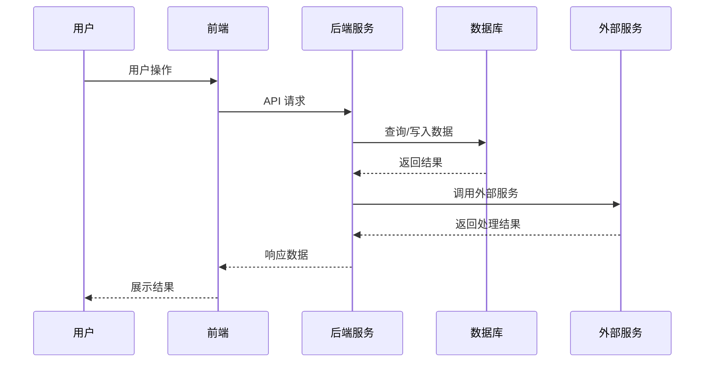
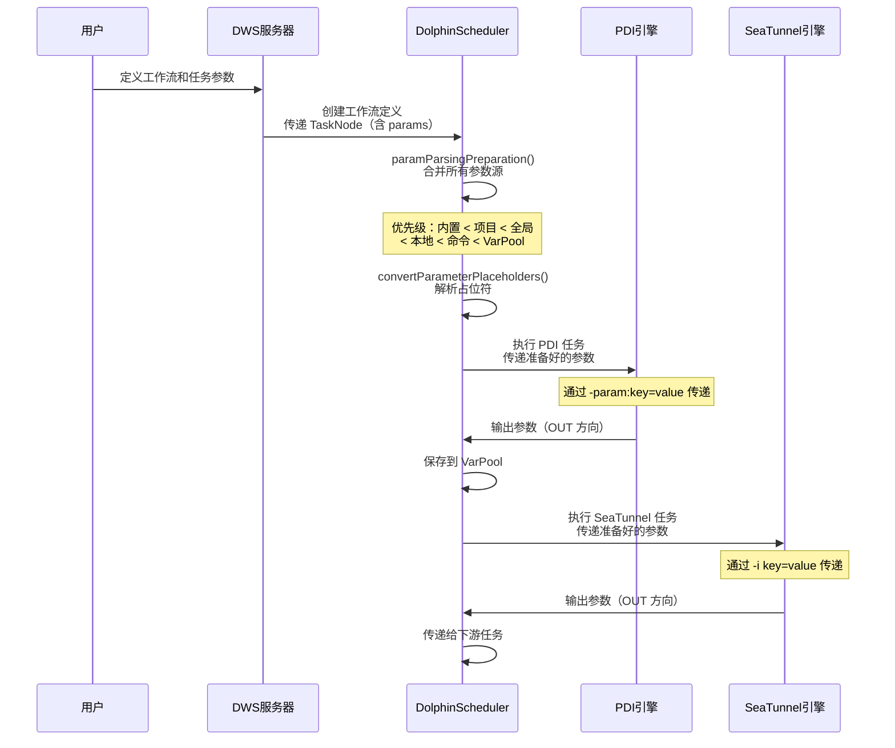

# 代码架构分析器

## 概述

本技能分析代码模块，为开发者提供深入的功能设计理解、实现原理、完整工作流程和数据库模型说明。帮助开发者理解功能如何运作、识别问题根因、系统地进行问题诊断。

## 使用时机

- **用户询问时**："这个功能如何工作？"、"为什么会出现这个问题？"、"帮助理解架构"、"我遇到了这个错误 - 可能是什么原因？"
- **用途**：功能设计理解、问题诊断、架构解释、调试指导
- **不用于**：简单文件读取、基础代码生成或不需要深入架构理解的任务

## 工作流程

### Step 1: 理解请求
- 识别要分析的具体功能或模块
- 确定分析范围（模块、服务或跨服务）
- 明确是否有需要诊断的具体问题

### Step 2: 分析代码库
1. **定位主要入口点**：功能的入口类或控制器,忽略 dolphinscheduler-api 中的控制器，控制器逻辑集中在dws-server、pubresmng-server
2. **映射相关文件和依赖**：识别所有相关代码文件
3. **识别核心组件和职责**：关键类、服务、工具类
4. **追踪完整工作流程**：从前端到数据库的完整调用链
5. **检查错误处理和日志模式**：异常处理、日志记录方式

### Step 3: 生成分析报告

创建全面的 Markdown 报告，严格按照以下章节：

## 报告结构

```markdown
# [功能名称] - 功能设计
```

## 1. 功能概述
- 功能的简要描述
- 业务价值和目的
- 核心职责

## 2. 功能设计
### 2.1 主要功能
- 功能的核心能力和特性
- 支持的操作类型

### 2.2 工作流程


### 2.3 数据模型
- 主要实体/DTO 说明
- 数据转换和序列化逻辑
- 数据库表结构

## 3. 数据库模型
- 相关数据库表及其字段说明
- 表之间的关系
- 关键索引和约束

## 4. 常见问题与排查指南
### 4.1 功能相关故障
| 症状 | 可能原因 | 检查点 | 定位方法 |
|------|----------|--------|----------|
| 错误 X | Service 层空指针 | 检查请求载荷、服务初始化 | Service 层日志 |
| 性能问题 | 数据库查询优化 | Repository 层 | 查询执行时间、索引检查 | 数据库慢查询日志 |

### 4.2 日志查看指南
- **应用日志**：查找与失败操作相关的模式
- **数据库日志**：检查慢查询、连接问题
- **错误码映射**：将错误消息对应到具体组件

### 4.3 问题定位方法
1. **日志分析**：在应用日志中搜索相关错误模式
2. **数据库检查**：验证数据一致性和查询性能
3. **链路追踪**：通过组件追踪请求流程
4. **单元测试**：隔离并重现问题
```

## 最佳实践

1. **从广到深**：从高层设计开始，再深入实现细节
2. **关注"为什么"**：解释设计决策，而不仅仅是"是什么"
3. **包含具体示例**：在有帮助时引用实际代码
4. **提供可操作的排查步骤**：明确告诉用户去哪里查找问题
5. **ALWAYS 使用 Mermaid 格式**：所有图表必须使用正确的 mermaid 代码块，绝不能使用 ASCII 文本图表。这一点至关重要。
6. **保持技术准确性**：确保分析反映实际的代码库

## 输出处理

- 将分析报告保存为 Markdown 文件
- 命名具有描述性：`[功能名称]-架构分析报告.md`
- 包含相关文件和行号的引用（格式：`path/to/file.java:123` 或 `path/to/file.java`）
- 提供到相关功能的交叉引用

## 输出示例参考

基于参数分析工作（DWS 参数系统），以下是正确使用 Mermaid 的示例：

**工作流程图**（展示数据流和交互顺序）：


**关键 Mermaid 元素**：
- 使用 `sequenceDiagram` 用于交互流程
- 使用 `graph TD`/`LR`/`TB` 用于架构图
- 使用 `subgraph` 对相关组件分组
- 使用 `Note over Component` 用于注释/说明
- 使用 `->>` 表示同步调用，`-->>` 表示异步响应
- 使用 `-->` 表示组件间关系

## 数据库模型分析要求

在功能设计分析中，必须包含完整的数据库模型说明：

1. **表结构**：主要表的字段、主键、索引
2. **表关系**：外键关系、关联查询
3. **CRUD 操作**：增删改查的交互逻辑
4. **数据流转**：工作流程中体现数据如何从表读取、处理、写入

常见数据库表类型示例：
```markdown
### t_ds_workflow_definition（工作流定义表）
| 字段名 | 类型 | 说明 |
|---------|------|------|
| id | INT | 主键 |
| name | VARCHAR | 工作流名称 |
| global_params | TEXT | 全局参数（JSON） |
| create_time | DATETIME | 创建时间 |
| update_time | DATETIME | 更新时间 |
```

### t_ds_task_definition（任务定义表）
| 字段名 | 类型 | 说明 |
|---------|------|------|
| id | INT | 主键 |
| workflow_code | BIGINT | 工作流编码 |
| task_type | VARCHAR | 任务类型 |
| task_params | TEXT | 任务参数（JSON） |
```
