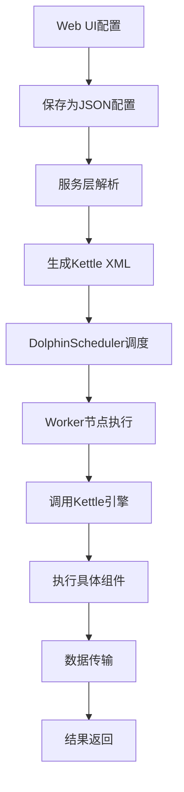
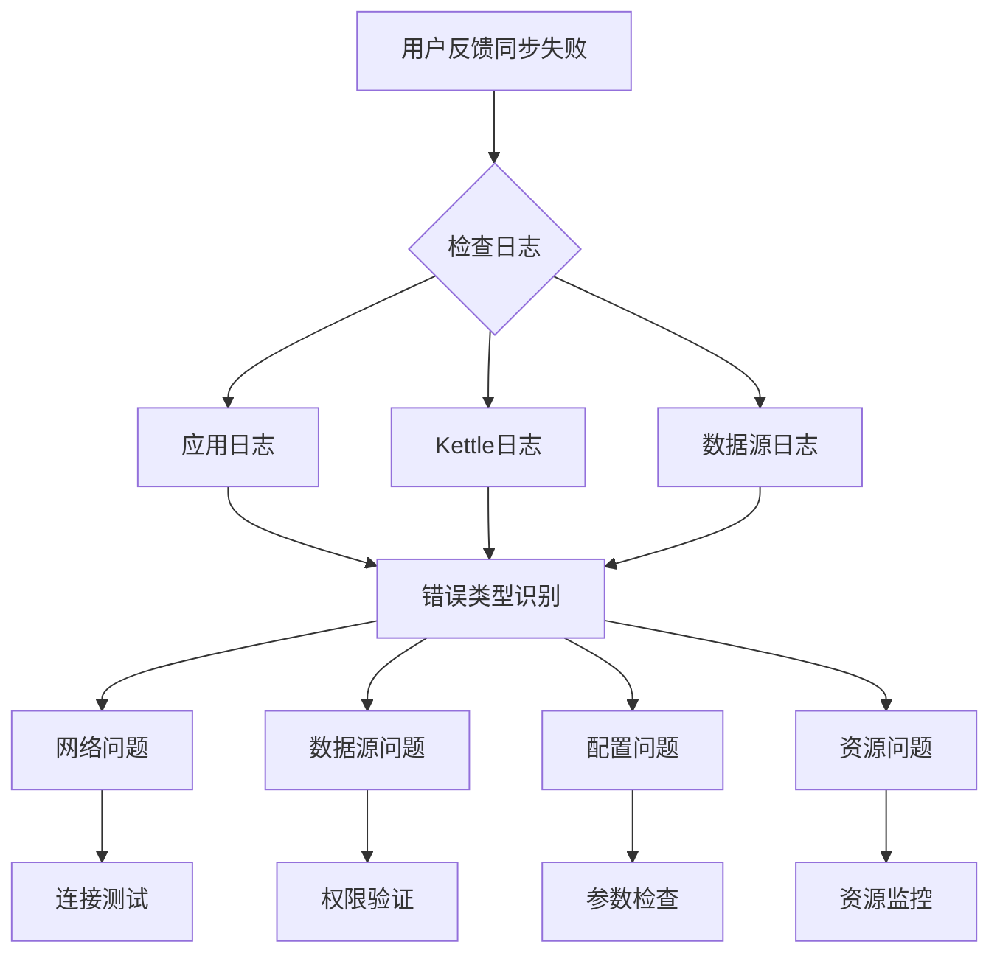
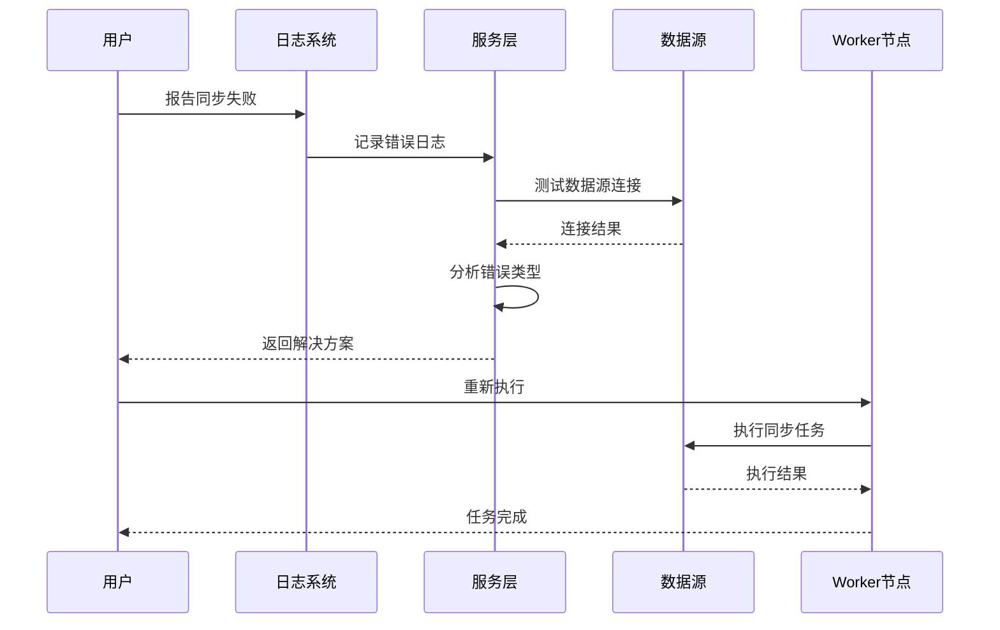

# DWS数据集成(ETL)架构分析

### 一、整体架构设计

DWS的数据集成模块基于 **Pentaho Data Integration (Kettle)** 引擎构建，采用分层架构设计：

```
┌─────────────────────────────────────────────────────────────┐
│                    UI/Controller 层                        │
├─────────────────────────────────────────────────────────────┤
│  Service 层 (业务逻辑)                                     │
│  ├─ DataIntegrationServiceFactory (服务工厂)               │
│  ├─ JobMetaService (作业元数据管理)                       │
│  ├─ TransMetaService (转换元数据管理)                     │
│  └─ JdbcDataBaseService (数据库服务)                       │
├─────────────────────────────────────────────────────────────┤
│  Component 层 (具体组件实现)                               │
│  ├─ JobEntryService (作业组件)                            │
│  ├─ IStepTransService (转换步骤服务)                       │
│  └─ IGenericTemplateService (模板服务)                    │
├─────────────────────────────────────────────────────────────┤
│  Handler/Adapter 层 (处理器/适配器)                       │
│  ├─ DatabaseMetaHandler (数据库元数据处理器)              │
│  ├─ DataBaseAdapter (数据库适配器)                        │
│  └─ dbmhandler (各数据库处理器)                           │
├─────────────────────────────────────────────────────────────┤
│      Kettle Core (底层引擎)                               │
└─────────────────────────────────────────────────────────────┘
```

### 二、数据流向

#### 1. 作业执行流程



#### 2. 详细执行步骤

1. **配置阶段**
   - 用户在Web UI拖拽组件，配置参数
   - 组件配置保存为JSON格式
   - 通过`DataIntegrationServiceFactory`获取对应服务

2. **元数据转换阶段**
   - `JobMetaService`或`TransMetaService`解析JSON配置
   - 生成Kettle的`JobMeta`或`TransMeta`
   - 设置数据源、步骤、跳线等

3. **XML生成阶段**
   - 将Kettle元数据序列化为XML
   - 包含完整的作业/转换定义
   - 注入参数配置

4. **调度执行阶段**
   - DolphinScheduler接收XML配置
   - 根据调度策略触发执行
   - Worker节点调用Kettle引擎

5. **运行时阶段**
   - Kettle引擎加载XML配置
   - 初始化数据源连接
   - 执行各组件间的数据流

### 三、核心组件分析

#### 1. 数据源管理

**DatabaseMetaHandler** 负责管理各种数据源：
- **支持数据库**: MySQL, Oracle, PostgreSQL, Hive, ClickHouse, HBase, SAP等
- **连接池管理**: 基于Kettle的DBCache
- **元数据获取**: 表结构、字段信息等

**关键代码位置**:
```
/com.primeton.dataworkshop.di/dbmhandler/
  ├── DatabaseMetaHandler.java (主处理器)
  ├── MySQLDatabaseMetaHandler.java
  ├── OracleDatabaseMetaHandler.java
  ├── HiveDatabaseMetaHandler.java
  └── ... (其他数据库处理器)
```

#### 2. 组件类型

**JobEntryService** (作业组件):
- 文件传输(Ftp/Sftp)
- 数据库操作(删除/插入/更新)
- 系统变量设置
- 作业跳转

**IStepTransService** (转换组件):
- **输入组件**: TableInput, ExcelInput, HiveInput, KafkaGet等
- **输出组件**: TableOutput, ExcelOutput, KafkaPut等
- **转换组件**: FilterRows, FieldSplitter, Join, Merge等
- **特殊组件**: 数据同步、定时同步等模板化组件

#### 3. 模板服务

**IGenericTemplateService** 提供预定义模板：
- 表迁移模板 (Table Migration)
- 定时同步模板 (Timestamp Sync)
- 全量同步模板 (Full Sync)
- MDM主数据同步

### 四、数据同步失败问题排查方法

#### 1. 问题定位框架



#### 2. 详细排查步骤

**Step 1: 错误日志分析**

查看位置:
- **应用日志**: `/logs/dws-dataworkshop.log`
- **Kettle日志**: 在作业执行目录下生成
- **DolphinScheduler日志**: API和Worker节点日志

常见错误类型:
```
1. 连接失败:
   - Connection refused
   - Authentication failed
   - Timeout

2. 数据错误:
   - Data type mismatch
   - Column count mismatch
   - Null constraint violation

3. 资源问题:
   - Out of memory
   - Disk space full
   - Too many open files

4. 配置错误:
   - Invalid SQL syntax
   - Missing parameters
   - Wrong datasource ID
```

**Step 2: 数据源连接测试**

使用`JdbcDataBaseService`测试连接:
```java
// 检查数据源连通性
DatabaseMeta databaseMeta = databaseMetaHandler.getDatabaseMeta(datasourceId);
Database database = new Database(databaseMeta);
boolean isConnected = database.connect();
```

**Step 3: 配置验证**

检查关键配置项:
- 数据源连接参数
- SQL语句语法
- 字段映射关系
- 参数配置

**Step 4: 资源监控**

- JVM内存使用情况
- 网络带宽
- 磁盘I/O
- 数据库连接数

#### 3. 常见问题及解决方案

**问题1: 数据库连接失败**
```
现象: "Connection refused" 或 "Timeout"
原因:
- 数据库服务未启动
- 网络不通
- 防火墙拦截
- 连接参数错误

解决方案:
1. 检查数据库服务状态
2. 测试网络连通性: telnet host port
3. 检查防火墙规则
4. 验证用户名密码
5. 检查连接池配置
```

**问题2: 数据类型转换错误**
```
现象: "Data type mismatch" 或 "Cannot cast to"
原因:
- 源表和目标表字段类型不匹配
- 特殊字符编码问题
- 数值精度溢出

解决方案:
1. 检查字段类型映射
2. 添加类型转换组件
3. 设置适当的字符集
4. 调整字段精度
```

**问题3: 内存溢出**
```
现象: "OutOfMemoryError"
原因:
- 单条记录过大
- 批量数据量过大
- 内存泄漏

解决方案:
1. 调整JVM参数
2. 减小批次大小
3. 增加内存资源
4. 优化SQL查询
```

**问题4: 权限不足**
```
现象: "Access denied" 或 "Permission denied"
原因:
- 用户权限不够
- 表/视图权限缺失
- 目录权限问题

解决方案:
1. 检查用户权限
2. 授予必要权限
3. 使用高权限用户
4. 检查文件系统权限
```

#### 4. 诊断工具

**内置诊断功能**:
1. **SQL预览**: `SQLPreviewService` 可预览SQL语句
2. **字段映射**: 检查字段映射关系
3. **参数替换**: `SQLVariableReplaceUtil` 验证参数替换
4. **连通性测试**: `DatabaseHelper.testConnection()`

**日志关键字搜索**:
```bash
# 搜索Kettle错误
grep -i "error\|exception\|failed" /path/to/kettle/logs

# 搜索连接问题
grep -i "connection\|jdbc\|socket" /path/to/application/logs

# 搜索内存问题
grep -i "memory\|heap\|gc" /path/to/application/logs
```

#### 5. 性能优化建议

1. **批次大小调整**:
   ```properties
   # 根据数据量调整
   sizeRowset=10000  # 默认值
   # 大数据量可适当增大
   sizeRowset=50000
   ```

2. **并发度控制**:
   ```java
   // SeaTunnel并发配置
   concurrentNum = 4  // 根据集群资源调整
   ```

3. **索引优化**:
   - 目标表创建适当索引
   - 查询字段添加索引
   - 定期维护索引

4. **资源监控**:
   - 监控JVM堆内存
   - 跟踪GC频率
   - 监控数据库连接数

### 五、故障处理流程



通过以上分析，可以看出DWS的数据集成模块架构清晰、组件化程度高。遇到同步失败时，应该从日志分析、数据源连接、配置验证、资源监控四个维度进行排查，大部分问题都可以在这些层面找到解决方案。