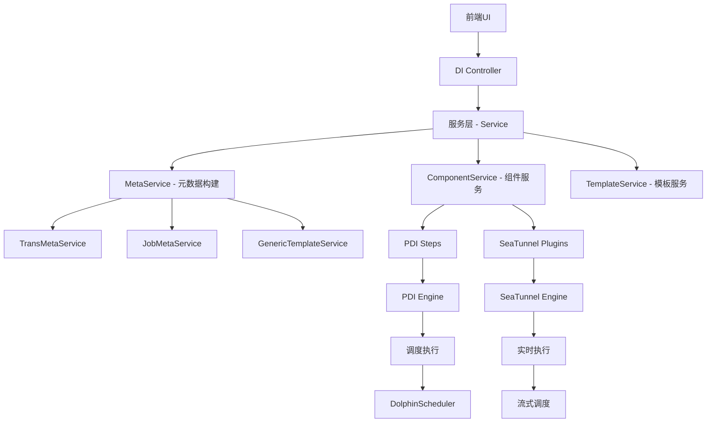

# DWS 数据集成（ETL）模块分析报告

## 1. 架构概述

### 1.1 核心架构
DWS 平台采用双重数据集成引擎设计，同时支持离线批处理和实时流式处理：

**离线处理（基于 PDI - Pentaho Data Integration）**：
- 使用 TransMetaService 处理转换（Transformation）作业
- 使用 JobMetaService 处理作业（Job）作业
- 支持 XML 格式的 dsr（trans）和 prj（job）文件

**实时处理（基于 SeaTunnel）**：
- 使用 SeaTunnel 作为实时数据集成引擎
- 支持多种数据源和目标端
- 基于 DataStream API 进行实时流处理

### 1.2 组件架构图



## 2. 核心模块详解

### 2.1 离线数据集成（PDI）模块

#### 2.1.1 TransMetaService（转换元数据服务）
- **职责**：将前端拖拽式界面配置转换为 PDI 的 TransMeta 对象
- **核心功能**：
  - 解析 JSON 配置文件
  - 构建 StepMeta（步骤元数据）
  - 处理组件间的连接关系
  - 设置参数和日志配置

#### 2.1.2 JobMetaService（作业元数据服务）
- **职责**：将前端配置转换为 PDI 的 JobMeta 对象
- **核心功能**：
  - 处理 JobEntry（作业条目）
  - 管理作业依赖关系（JobHop）
  - 设置命名参数和日志配置

#### 2.1.3 组件类型（StepTypeEnum）
包含以下主要组件类型：
- **输入组件**：表输入、文件输入、JDBC输入等
- **转换组件**：过滤、排序、聚合、字段映射等
- **输出组件**：表输出、文件输出、API输出等
- **控制组件**：行生成器、执行语句等

### 2.2 实时数据集成（SeaTunnel）模块

#### 2.2.1 SeaTunnelPluginTypeEnum（插件枚举）
支持 60+ 种数据源和目标：
- **关系型数据库**：MySQL、PostgreSQL、Oracle、SQL Server、TiDB等
- **大数据存储**：Hive、HBase、ClickHouse、StarRocks、Doris等
- **消息队列**：Kafka、RocketMQ、RabbitMQ等
- **文件系统**：本地文件、S3、MinIO等
- **其他**：Elasticsearch、Redis、Neo4j、MongoDB等

#### 2.2.2 RealTimeComponentService（实时组件服务）
- **职责**：提供实时数据源的元数据获取
- **核心功能**：
  - 动态获取源表字段信息
  - 处理文件格式解析（CSV、JSON、Excel、XML等）
  - 支持CDC数据源字段映射

### 2.3 工厂模式实现

#### 2.3.1 DataIntegrationServiceFactory
工厂类统一管理各类服务：
```java
public static IStepTransService getTransService(StepTypeEnum typeEnum)
public static IJobEntryService getJobService(JobEntryTypeEnum typeEnum)
public static IGenericTemplateService getTemplateService(TemplateJobEnum typeEnum)
public static ISeaTunnelPluginService getPluginService(SeaTunnelPluginTypeEnum typeEnum)
```

## 3. 数据流分析

### 3.1 离线作业数据流

```
前端配置 → JSON解析 → 元数据构建 → XML生成 → PDI执行 → DolphinScheduler调度
```

1. **配置阶段**：
   - 用户通过拖拽式界面配置作业
   - 生成包含组件和连接关系的 JSON 配置

2. **元数据构建**：
   - TransMetaService/JobMetaService 解析 JSON
   - 将每个组件转换为对应的 PDI StepMeta/JobEntry
   - 建立组件间的依赖关系

3. **执行阶段**：
   - 生成 PDI XML 文件（dsr/prj）
   - DolphinScheduler 调度执行
   - PDI 引擎解析并执行作业

### 3.2 实时作业数据流

```
前端配置 → JSON解析 → SeaTunnel配置构建 → StreamJob构建 → 实时执行
```

1. **配置阶段**：
   - 配置数据源、转换器和目标端
   - 设置流处理参数

2. **配置构建**：
   - RealTimeComponentService 构建配置对象
   - 转换为 SeaTunnel Job 配置

3. **执行阶段**：
   - 提交到 SeaTunnel 引擎
   - 实时流处理

## 4. 问题定位方法

### 4.1 数据同步失败的可能原因

#### 4.1.1 配置问题
- **数据源配置错误**：
  - 连接参数错误（IP、端口、用户名、密码）
  - 数据源连接超时
  - 权限不足

- **SQL/配置语法错误**：
  - SQL 语法错误
  - 表不存在或字段名错误
  - 数据类型不匹配

#### 4.1.2 资源问题
- **资源不足**：
  - 内存不足导致作业失败
  - 磁盘空间不足
  - CPU 资源瓶颈

- **网络问题**：
  - 网络延迟或中断
  - 防火墙阻止
  - 负载过高

#### 4.1.3 数据问题
- **数据质量问题**：
  - 重复数据
  - 空值处理不当
  - 数据格式错误

- **数据量问题**：
  - 单表数据量过大
  - 并发数据量大
  - 数据倾斜

### 4.2 问题诊断步骤

#### 4.2.1 第一步：查看日志
- **DWS 日志**：
  - 检查 `/Users/zhaord/Workstation/code/dws/dws-server/logs` 目录
  - 重点查看 error.log 和 exception.log

- **调度系统日志**：
  - DolphinScheduler 任务日志
  - 查看具体失败步骤的错误信息

- **执行引擎日志**：
  - PDI 作业执行日志
  - SeaTunnel 引擎日志

#### 4.2.2 第二步：检查配置
1. **数据源配置验证**：
   ```java
   // 数据源连接测试
   Database database = jdbcDataBaseService.getDatabase(envType, datasourceId);
   database.connect();
   // 检查是否连接成功
   ```

2. **SQL 语句验证**：
   - 在 SQL 预览功能中验证 SQL 语法
   - 检查表名、字段名是否正确
   - 确认数据类型兼容性

3. **参数验证**：
   - 检查命名参数是否正确设置
   - 验证全局参数是否生效

#### 4.2.3 第三步：组件状态检查
- **查看组件字段映射**：
  - 检查输入输出字段是否匹配
  - 确认字段类型转换是否正确

- **查看数据量**：
  - 检查源数据量是否合理
  - 确认目标表是否有足够空间

#### 4.2.4 第四步：性能分析
- **慢查询分析**：
  - 使用数据库慢查询日志
  - 优化 SQL 查询语句

- **内存使用情况**：
  - 检查 JVM 内存使用
  - 调整 PDI/SeaTunnel 内存配置

### 4.3 常见错误代码及解决方案

#### 4.3.1 连接相关错误
```
FS_FTP_CONNECT_FAIL: FTP 连接失败
SFTP_CONNECT_FAIL: SFTP 连接失败
FS_OSS_CONNECT_FAIL: OSS 连接失败
DATASOURCE_EXCEPTION: 数据源异常
```

**解决方案**：
1. 检查网络连通性
2. 验证认证信息
3. 检查服务器状态

#### 4.3.2 SQL 相关错误
```
SQL_SYNTAX_ERROR: SQL 语法错误
SQL_EXCEPTION: SQL 执行异常
TABLE_NOT_EXIST: 表不存在
FIELD_NOT_EXIST: 字段不存在
```

**解决方案**：
1. 使用 SQL 预览功能验证
2. 检查表结构是否变化
3. 确认权限是否足够

#### 4.3.3 文件相关错误
```
FILE_NOT_EXIST: 文件不存在
FILE_OP_COMMON_EXCEPTION: 文件操作异常
FILE_SIZE_LARGE: 文件过大
```

**解决方案**：
1. 检查文件路径是否正确
2. 验证文件权限
3. 考虑文件分片处理

#### 4.3.4 转换相关错误
```
GRAPHIC_RECTS_NOT_FOUND: 图形组件不存在
GRAPHIC_STEP_META_NOT_FOUND: 步骤元数据不存在
GET_FIELD_FAIL: 获取字段失败
```

**解决方案**：
1. 检查配置完整性
2. 重新构建元数据
3. 检查组件依赖关系

### 4.4 高级诊断工具

#### 4.4.1 数据血缘分析
- 使用 sqlflow 模块分析数据血缘
- 追踪数据流向和依赖关系
- 定位问题影响的范围

#### 4.4.2 性能监控
- 使用 DWS 自带的监控功能
- 监控数据同步耗时
- 分析资源使用情况

#### 4.4.3 调试模式
- 开启 PDI 调试模式
- 逐步骤执行作业
- 查看中间结果

## 5. 最佳实践

### 5.1 配置最佳实践
1. **数据源配置**：
   - 使用连接池
   - 设置合理的超时时间
   - 定期测试连接

2. **SQL 优化**：
   - 避免全表扫描
   - 使用索引
   - 分批处理大数据量

3. **组件设计**：
   - 避免过长的作业链
   - 合理使用并行处理
   - 设置合适的缓冲区大小

### 5.2 问题预防措施
1. **开发阶段**：
   - 使用预览功能验证配置
   - 开启详细日志
   - 进行小数据量测试

2. **部署阶段**：
   - 监控系统资源
   - 设置合理的告警阈值
   - 定期备份配置

3. **运维阶段**：
   - 定期清理日志
   - 优化作业性能
   - 建立问题处理流程

## 6. 总结

DWS 数据集成模块采用双引擎架构，同时支持离线和实时处理。通过模块化的设计和工厂模式实现了高度的扩展性。遇到数据同步失败时，应按照以下步骤进行问题定位：

1. 查看相关日志
2. 检查配置是否正确
3. 验证数据源连接
4. 分析性能瓶颈
5. 使用工具辅助诊断

关键文件路径：
- 元数据服务：`/Users/zhaord/Workstation/code/dws/dws-server/com.primeton.dataworkshop.di/src/com/primeton/dataworkshop/di/service/`
- 控制器：`/Users/zhaord/Workstation/code/dws/dws-server/com.primeton.dataworkshop.di/src/com/primeton/dataworkshop/di/controller/`
- 实时组件：`/Users/zhaord/Workstation/code/dws/dws-server/com.primeton.dataworkshop.di/src/com/primeton/dataworkshop/realtime/`
- 异常码：`/Users/zhaord/Workstation/code/dws/dws-server/com.primeton.dataworkshop.model/src/com/primeton/dataworkshop/model/exception/DWSExceptionCode.java`